# 🗄️ ERD — Juruladen

> **Entity Relationship Diagram** — skema database lengkap untuk aplikasi Juruladen.
> Semua tabel baru ditambahkan ke database Laravel eksisting (prefix default, tanpa schema terpisah).

---

## 1. Diagram Relasi Utama

```mermaid
erDiagram
    Event ||--o{ CommitteeDivision : "has"
    Event ||--o{ Rundown : "has"
    Event ||--o{ InventoryItem : "has"
    Event ||--o{ McAssignment : "has"
    Event ||--o{ CateringSchedule : "has"
    Event ||--o{ ParticipantPool : "has"
    Event ||--o{ DesignNeed : "has"
    Event ||--o{ BroadcastLog : "has"
    Event ||--o{ Documentation : "has"
    Event ||--o{ BudgetPlan : "has"
    Event ||--o{ IncomeEntry : "has"
    Event ||--o{ ExpenseEntry : "has"
    Event ||--o{ MerchProduct : "has"
    Event ||--o{ MerchOrder : "has"
    Event ||--o{ MerchCampaign : "has"
    Event ||--o{ WaRecipient : "has"
    Event ||--o{ WaBlastTemplate : "has"
    Event ||--o{ NotificationLog : "has"
    Event ||--o{ SheetsExportConfig : "has"

    CommitteeDivision ||--o{ CommitteeMember : "has"
    CommitteeDivision ||--o{ CommitteeTask : "has"
    CommitteeTask ||--o{ CommitteeTask : "parent_subtask"

    Rundown ||--o{ RundownItem : "contains"
    RundownItem }o--|| CateringSchedule : "linked_to"

    InventoryCategory ||--o{ InventoryItem : "categorizes"

    ParticipantPool ||--o{ ParticipantPoolMember : "contains"
    Event ||--o{ ParticipantPresence : "has"

    BudgetPlan ||--o{ BudgetLine : "contains"
    BudgetLine ||--o{ IncomeEntry : "linked_transaction"
    BudgetLine ||--o{ ExpenseEntry : "linked_transaction"
    ExpenseCategory ||--o{ ExpenseEntry : "categorizes"

    MerchProduct ||--o{ MerchVariant : "has_variants"
    MerchProduct ||--o{ MerchVendorAssignment : "assigned_to"
    MerchVariant ||--o{ MerchVendorAssignment : "assigned_to"
    MerchVendor ||--o{ MerchVendorAssignment : "provides"
    MerchOrder ||--o{ MerchOrderItem : "contains"
    MerchOrderItem }o--|| MerchProduct : "references"
    MerchOrderItem }o--|| MerchVariant : "references"

    Person ||--o{ CommitteeMember : "member_of"
    Person ||--o{ CommitteeTask : "assignee"
    Person ||--o{ RundownItem : "pic"
    Person ||--o{ McAssignment : "mc"
    Person ||--o{ ParticipantPoolMember : "participant"
    Person ||--o{ ParticipantPresence : "checked_in"
    Person ||--o{ DesignNeed : "assignee"
    Person ||--o{ IncomeEntry : "payer"
    Person ||--o{ MerchOrder : "buyer"
    Person ||--o{ WaRecipient : "linked_person"

    User ||--o{ NotificationLog : "recipient"
    User ||--o{ NotificationPreference : "preferences"
```

---

## 2. Tabel Detail

> Semua tabel memiliki kolom standar: `id` (PK, auto-increment), `created_at`, `updated_at` (timestamps).

### 2.1 Extend Existing `events` Table

| Kolom Baru | Tipe | Deskripsi |
|------------|------|-----------|
| `budget_total` | decimal(15,2) nullable | Total anggaran (dari budget_plans) |
| `budget_status` | varchar(20) default 'draft' | draft / approved / active / closed |
| `is_juruladen_active` | boolean default false | Flag: event ini dikelola via Juruladen |

### 2.1c Extend Existing `users` Table

> Tabel `users` sudah ada dengan kolom `person_id`, `role`, `password`. Juruladen menggunakan NIB-based auth sehingga perlu minor alter.

| Kolom | Sebelum | Sesudah | Alasan |
|-------|---------|---------|--------|
| `email` | NOT NULL UNIQUE | **NULL** UNIQUE | Juruladen user login dengan NIB, email opsional |
| `password` | NOT NULL | **NULL** | NULL = first-time user (belum set password) |

> **Logic auth**: `password IS NULL` → user baru, tampilkan form "Lengkapi Data Akun" (email + password + konfirmasi). `password IS NOT NULL` → user returning, tampilkan form password saja.
> **Email**: Diisi user saat first-time login (untuk notifikasi). Superadmin tidak perlu mengisi email saat menambah user.
> **Reset password**: Superadmin/Ketua set `password = NULL` → user kembali ke flow first-time (isi ulang email + password baru).

### 2.1b Extend Existing `event_registrations` Table

> Tabel `event_registrations` sudah ada di codebase. Juruladen menambah kolom berikut untuk kebutuhan peserta, RSVP, pool, dan presensi.

| Kolom Baru | Tipe | Deskripsi |
|------------|------|-----------|
| `pool_label` | varchar(100) nullable | Label pool peserta (contoh: "Peserta Merajut Cinta 2026"). NULL = registrasi umum, non-NULL = bagian dari pool kurasi panitia. INDEX |
| `presence_at` | datetime nullable | Timestamp check-in/presensi saat hari-H. NULL = belum check-in |

> **Catatan**: Kolom `person_id`, `attendance` (hadir/tidak_hadir), `status` (pending/approved/rejected) sudah ada dari migrasi sebelumnya. Dengan tambahan ini, **tidak perlu** tabel `participant_pools`, `participant_pool_members`, `participant_presences`.

---

### 2.2 Committee & Task Management

#### `committee_divisions`
| Kolom | Tipe | Constraint |
|-------|------|------------|
| `event_id` | FK → events.id | NOT NULL, INDEX |
| `name` | varchar(100) | NOT NULL |
| `slug` | varchar(50) | NOT NULL (ketua/acara/humas/pendanaan/merchandise) |
| `description` | text | nullable |
| `sort_order` | integer | default 0 |

#### `committee_members`
| Kolom | Tipe | Constraint |
|-------|------|------------|
| `division_id` | FK → committee_divisions.id | NOT NULL, INDEX |
| `person_id` | FK → persons.id | NOT NULL, INDEX |
| `role` | varchar(50) | NOT NULL (ketua/anggota) |
| `responsibilities` | text | nullable |

#### `committee_tasks`
| Kolom | Tipe | Constraint |
|-------|------|------------|
| `division_id` | FK → committee_divisions.id | NOT NULL, INDEX |
| `parent_task_id` | FK → committee_tasks.id (self-ref) | nullable (untuk sub-task) |
| `title` | varchar(255) | NOT NULL |
| `description` | text | nullable |
| `status` | varchar(20) | NOT NULL default 'todo' (todo/in_progress/done/blocked) |
| `priority` | varchar(10) | default 'medium' (low/medium/high/urgent) |
| `deadline` | datetime | nullable |
| `assignee_id` | FK → persons.id | nullable, INDEX |
| `sort_order` | integer | default 0 |

#### `task_templates`
| Kolom | Tipe | Constraint |
|-------|------|------------|
| `division_slug` | varchar(50) | NOT NULL |
| `title` | varchar(255) | NOT NULL |
| `description` | text | nullable |
| `sort_order` | integer | default 0 |

---

### 2.3 Rundown & Guidelines

#### `rundowns`
| Kolom | Tipe | Constraint |
|-------|------|------------|
| `event_id` | FK → events.id | NOT NULL, INDEX |
| `section_type` | varchar(30) | NOT NULL (jadwal_acara/setup/persiapan) |
| `version` | integer | default 1 |

#### `rundown_items`
| Kolom | Tipe | Constraint |
|-------|------|------------|
| `rundown_id` | FK → rundowns.id | NOT NULL, INDEX |
| `time_start` | time | NOT NULL |
| `time_end` | time | nullable |
| `duration_minutes` | integer | nullable |
| `activity_title` | varchar(255) | NOT NULL |
| `description` | text | nullable |
| `pic_person_id` | FK → persons.id | nullable |
| `location_venue` | varchar(255) | nullable |
| `notes` | text | nullable |
| `sort_order` | integer | default 0 |

#### `event_guidelines`
| Kolom | Tipe | Constraint |
|-------|------|------------|
| `event_id` | FK → events.id | NOT NULL, INDEX |
| `type` | varchar(30) | NOT NULL (technical/pelaksanaan) |
| `content` | longText | nullable (rich text HTML/Markdown) |
| `version` | integer | default 1 |

---

### 2.4 Inventory / Perlengkapan

#### `inventory_categories`
| Kolom | Tipe | Constraint |
|-------|------|------------|
| `name` | varchar(100) | NOT NULL |
| `slug` | varchar(50) | NOT NULL, UNIQUE |
| `description` | text | nullable |

#### `inventory_items`
| Kolom | Tipe | Constraint |
|-------|------|------------|
| `event_id` | FK → events.id | NOT NULL, INDEX |
| `category_id` | FK → inventory_categories.id | NOT NULL |
| `name` | varchar(255) | NOT NULL |
| `quantity_needed` | integer | default 1 |
| `quantity_acquired` | integer | default 0 |
| `unit` | varchar(30) | default 'pcs' |
| `source_type` | varchar(20) | NOT NULL (beli/pinjam/sewa/sumbangan) |
| `source_detail` | varchar(255) | nullable (nama toko/orang) |
| `cost_per_unit` | decimal(15,2) | nullable |
| `total_cost` | decimal(15,2) | nullable |
| `acquisition_status` | varchar(20) | default 'pending' (pending/confirmed/delivered) |
| `return_status` | varchar(20) | default 'not_applicable' (not_applicable/pending/returned) |
| `assigned_to_person_id` | FK → persons.id | nullable |
| `notes` | text | nullable |

---

### 2.5 MC Assignments

#### `mc_assignments`
| Kolom | Tipe | Constraint |
|-------|------|------------|
| `event_id` | FK → events.id | NOT NULL, INDEX |
| `person_id` | FK → persons.id | NOT NULL |
| `role` | varchar(50) | NOT NULL (mc_utama/co_mc/qori/tilawah/lainnya) |
| `segment_description` | varchar(255) | nullable |
| `notes` | text | nullable |

---

### 2.6 Catering / Konsumsi

#### `catering_schedules`
| Kolom | Tipe | Constraint |
|-------|------|------------|
| `event_id` | FK → events.id | NOT NULL, INDEX |
| `rundown_item_id` | FK → rundown_items.id | nullable (dikaitkan ke rundown) |
| `time_serve` | time | NOT NULL |
| `meal_type` | varchar(20) | NOT NULL (berat/ringan/snack/minum) |
| `menu_name` | varchar(255) | NOT NULL |
| `portion_count` | integer | NOT NULL |
| `source` | varchar(50) | NOT NULL (dimasak_sendiri/catering/nasi_kotak) |
| `vendor_name` | varchar(255) | nullable |
| `cost_per_portion` | decimal(15,2) | nullable |
| `total_cost` | decimal(15,2) | nullable |
| `dietary_notes` | text | nullable |

#### `catering_vendors` *(opsional — V1 bisa skip)*
| Kolom | Tipe | Constraint |
|-------|------|------------|
| `name` | varchar(255) | NOT NULL |
| `contact_person` | varchar(255) | nullable |
| `phone` | varchar(30) | nullable |
| `specialty` | varchar(100) | nullable |
| `notes` | text | nullable |

---

### 2.7 Participants & RSVP (Humas)

> ✅ **Tidak ada tabel baru.** Seluruh data peserta, RSVP, pool, dan presensi menggunakan tabel existing `event_registrations` yang sudah diperluas (lihat [§2.1b](#21b-extend-existing-event_registrations-table)).

| Kebutuhan | Kolom `event_registrations` |
|-----------|------------------------------|
| Registrasi peserta | `person_id` / `name` + `event_id` |
| RSVP (hadir/tidak) | `attendance` (hadir/tidak_hadir) |
| Pool peserta kurasi | `pool_label` (filterable) |
| Presensi check-in | `presence_at` (timestamp) |
| Approval | `status` (pending/approved/rejected) |

---

### 2.8 Publication & WhatsApp (Humas)

#### `design_needs`
| Kolom | Tipe | Constraint |
|-------|------|------------|
| `event_id` | FK → events.id | NOT NULL, INDEX |
| `title` | varchar(255) | NOT NULL |
| `description` | text | nullable |
| `target_platform` | varchar(30) | NOT NULL (ig_feed/ig_story/wa_poster/fb/banner/spanduk) |
| `content_info` | text | nullable (teks yang harus ada di desain) |
| `status` | varchar(20) | default 'pending' (pending/in_progress/done) |
| `assignee_person_id` | FK → persons.id | nullable |
| `deadline` | date | nullable |
| `final_file_url` | varchar(500) | nullable |

#### `broadcast_logs`
| Kolom | Tipe | Constraint |
|-------|------|------------|
| `event_id` | FK → events.id | NOT NULL, INDEX |
| `platform` | varchar(30) | NOT NULL (wa_group/ig_reels/ig_post/ig_story/fb_group) |
| `target_name` | varchar(255) | nullable (nama grup/platform) |
| `message_type` | varchar(30) | NOT NULL (poster/pengumuman/pengingat/campaign/lainnya) |
| `sent_at` | datetime | nullable |
| `status` | varchar(20) | default 'scheduled' (scheduled/sent/failed) |
| `wablas_message_id` | varchar(100) | nullable (ID pesan dari Wablas API — hanya untuk platform wa_group) |
| `recipient_count` | integer | default 0 |
| `notes` | text | nullable |

#### `documentations`
| Kolom | Tipe | Constraint |
|-------|------|------------|
| `event_id` | FK → events.id | NOT NULL, INDEX |
| `type` | varchar(30) | NOT NULL (photo/video/livestream/after_movie) |
| `title` | varchar(255) | NOT NULL |
| `description` | text | nullable |
| `url` | varchar(500) | nullable |
| `file_path` | varchar(500) | nullable |
| `taken_by_person_id` | FK → persons.id | nullable |
| `taken_at` | datetime | nullable |

#### `wa_blast_templates`
| Kolom | Tipe | Constraint |
|-------|------|------------|
| `event_id` | FK → events.id | NOT NULL, INDEX |
| `title` | varchar(255) | NOT NULL |
| `body_text` | text | NOT NULL |
| `category` | varchar(30) | NOT NULL (campaign/pengumuman/pengingat) |
| `created_by` | FK → users.id | nullable |

#### `wa_recipients`
| Kolom | Tipe | Constraint |
|-------|------|------------|
| `event_id` | FK → events.id | NOT NULL, INDEX |
| `group_label` | varchar(100) | nullable (label grup: "Panitia Inti", "Anggota Cabang Ngaglik", dll) |
| `phone_number` | varchar(20) | NOT NULL |
| `person_id` | FK → persons.id | nullable (link ke data person jika ada) |
| `is_active` | boolean | default true |

---

### 2.9 Finance / Pendanaan

#### `budget_plans`
| Kolom | Tipe | Constraint |
|-------|------|------------|
| `event_id` | FK → events.id | NOT NULL, INDEX |
| `name` | varchar(255) | NOT NULL |
| `version` | integer | default 1 |
| `status` | varchar(20) | default 'draft' (draft/approved/active/closed) |
| `approved_by` | FK → users.id | nullable |
| `approved_at` | datetime | nullable |

#### `budget_lines`
| Kolom | Tipe | Constraint |
|-------|------|------------|
| `budget_plan_id` | FK → budget_plans.id | NOT NULL, INDEX |
| `category` | varchar(20) | NOT NULL (income/expense) |
| `subcategory` | varchar(100) | nullable |
| `description` | varchar(255) | NOT NULL |
| `planned_amount` | decimal(15,2) | NOT NULL default 0 |
| `actual_amount` | decimal(15,2) | NOT NULL default 0 — AUTO-COMPUTED dari transaksi terkait |
| `paid_amount` | decimal(15,2) | NOT NULL default 0 — AUTO-COMPUTED: SUM(expense_entries.amount) / SUM(income_entries.amount) WHERE budget_line_id = X |
| `payment_status` | varchar(20) | NOT NULL default 'unpaid' — AUTO-COMPUTED: unpaid/partial/paid berdasarkan perbandingan paid_amount vs planned_amount |
| `notes` | text | nullable |

#### `expense_categories`
| Kolom | Tipe | Constraint |
|-------|------|------------|
| `name` | varchar(100) | NOT NULL |
| `slug` | varchar(50) | NOT NULL, UNIQUE (venue/konsumsi/dekorasi/dokumentasi/transport/honorarium/atk/lainnya) |
| `description` | text | nullable |

#### `income_entries`
| Kolom | Tipe | Constraint |
|-------|------|------------|
| `event_id` | FK → events.id | NOT NULL, INDEX |
| `budget_line_id` | FK → budget_lines.id | nullable (link ke budget line) |
| `category` | varchar(30) | NOT NULL (iuran/donasi/sponsor/merchandise/tiket/lainnya) |
| `amount` | decimal(15,2) | NOT NULL |
| `payer_name` | varchar(255) | nullable |
| `payer_person_id` | FK → persons.id | nullable |
| `payment_method` | varchar(20) | NOT NULL (cash/transfer/qris) |
| `payment_date` | date | NOT NULL |
| `receipt_number` | varchar(100) | nullable |
| `notes` | text | nullable |
| `recorded_by` | FK → users.id | NOT NULL |

#### `expense_entries`
| Kolom | Tipe | Constraint |
|-------|------|------------|
| `event_id` | FK → events.id | NOT NULL, INDEX |
| `budget_line_id` | FK → budget_lines.id | nullable (link ke budget line) |
| `category_id` | FK → expense_categories.id | NOT NULL |
| `amount` | decimal(15,2) | NOT NULL |
| `payee_name` | varchar(255) | nullable |
| `payment_method` | varchar(20) | NOT NULL (cash/transfer/qris) |
| `payment_date` | date | NOT NULL |
| `invoice_number` | varchar(100) | nullable |
| `receipt_image_url` | varchar(500) | nullable (upload bukti) |
| `notes` | text | nullable |
| `recorded_by` | FK → users.id | NOT NULL |

---

### 2.10 Merchandise

#### `merch_products`
| Kolom | Tipe | Constraint |
|-------|------|------------|
| `event_id` | FK → events.id | NOT NULL, INDEX |
| `name` | varchar(255) | NOT NULL |
| `description` | text | nullable |
| `base_price` | decimal(15,2) | nullable (null jika pakai varian) |
| `hpp` | decimal(15,2) | nullable (HPP dasar) |
| `is_paid_event_product` | boolean | default false (terintegrasi event berbayar) |
| `image_url` | varchar(500) | nullable |
| `is_active` | boolean | default true |

#### `merch_variant_dimensions`
| Kolom | Tipe | Constraint |
|-------|------|------------|
| `product_id` | FK → merch_products.id | NOT NULL, INDEX |
| `name` | varchar(100) | NOT NULL (contoh: "Ukuran", "Panjang Lengan", "Warna", "Usia") |
| `sort_order` | integer | default 0 |

> Satu produk bisa punya banyak dimensi. Dimensi ini yang akan membentuk baris dan kolom di tabel pivot rekap vendor.

#### `merch_variant_dimension_values`
| Kolom | Tipe | Constraint |
|-------|------|------------|
| `dimension_id` | FK → merch_variant_dimensions.id | NOT NULL, INDEX, CASCADE |
| `value` | varchar(100) | NOT NULL (contoh: "XL", "Pendek", "Hitam", "Dewasa") |
| `sort_order` | integer | default 0 |
| UNIQUE | (dimension_id, value) | |

#### `merch_variants` *(SKU / Kombinasi Dimensi)*
| Kolom | Tipe | Constraint |
|-------|------|------------|
| `product_id` | FK → merch_products.id | NOT NULL, INDEX |
| `sku` | varchar(50) | nullable (kode unik opsional) |
| `price` | decimal(15,2) | NOT NULL |
| `hpp` | decimal(15,2) | nullable |
| `sort_order` | integer | default 0 |
| `is_active` | boolean | default true |

> Setiap varian adalah **kombinasi dari satu value per dimensi**. Contoh: Kaos dengan kombinasi Lengan=Pendek + Ukuran=XL + Warna=Hitam + Usia=Dewasa = satu varian/SKU dengan harga & HPP tertentu.

#### `merch_variant_combination_values` *(Pivot)*
| Kolom | Tipe | Constraint |
|-------|------|------------|
| `variant_id` | FK → merch_variants.id | NOT NULL, INDEX, CASCADE |
| `dimension_value_id` | FK → merch_variant_dimension_values.id | NOT NULL, INDEX |
| UNIQUE | (variant_id, dimension_value_id) | |

> Relasi many-to-many: satu varian tersusun dari beberapa dimension value, dan satu dimension value bisa dipakai di banyak varian.

#### `merch_vendors`
| Kolom | Tipe | Constraint |
|-------|------|------------|
| `name` | varchar(255) | NOT NULL |
| `contact_person` | varchar(255) | nullable |
| `phone` | varchar(30) | nullable |
| `address` | text | nullable |
| `notes` | text | nullable |

#### `merch_vendor_assignments`
| Kolom | Tipe | Constraint |
|-------|------|------------|
| `product_id` | FK → merch_products.id | NOT NULL |
| `variant_id` | FK → merch_variants.id | nullable |
| `vendor_id` | FK → merch_vendors.id | NOT NULL |
| `production_cost` | decimal(15,2) | nullable |
| `min_order_qty` | integer | default 0 |

#### `merch_orders`
| Kolom | Tipe | Constraint |
|-------|------|------------|
| `event_id` | FK → events.id | NOT NULL, INDEX |
| `buyer_person_id` | FK → persons.id | NOT NULL |
| `status` | varchar(20) | default 'pending' (pending/confirmed/paid/cancelled) |
| `total_amount` | decimal(15,2) | NOT NULL default 0 |
| `payment_method` | varchar(20) | nullable (cash/transfer/qris) |
| `payment_status` | varchar(20) | default 'unpaid' (unpaid/partial/paid) |
| `paid_at` | datetime | nullable |
| `notes` | text | nullable |
| `ordered_at` | datetime | NOT NULL |

#### `merch_order_items`
| Kolom | Tipe | Constraint |
|-------|------|------------|
| `order_id` | FK → merch_orders.id | NOT NULL, INDEX |
| `product_id` | FK → merch_products.id | NOT NULL |
| `variant_id` | FK → merch_variants.id | nullable |
| `person_id` | FK → persons.id | nullable — orang yang dipesankan (jika satu order berisi item untuk beberapa orang berbeda, misal kepala keluarga memesankan untuk anggota keluarga) |
| `quantity` | integer | NOT NULL default 1 |
| `unit_price` | decimal(15,2) | NOT NULL |
| `subtotal` | decimal(15,2) | NOT NULL (qty × unit_price) |

#### `merch_campaigns`
| Kolom | Tipe | Constraint |
|-------|------|------------|
| `event_id` | FK → events.id | NOT NULL, INDEX |
| `product_id` | FK → merch_products.id | NOT NULL |
| `platform` | varchar(20) | default 'wa_group' |
| `message_template` | text | nullable (template pesan campaign) |
| `started_at` | datetime | nullable |
| `ended_at` | datetime | nullable |
| `status` | varchar(20) | default 'draft' (draft/active/ended) |

---

### 2.11 Notifications

#### `notification_logs`
| Kolom | Tipe | Constraint |
|-------|------|------------|
| `event_id` | FK → events.id | NOT NULL, INDEX |
| `recipient_user_id` | FK → users.id | NOT NULL, INDEX |
| `channel` | varchar(10) | NOT NULL default 'email' |
| `type` | varchar(30) | NOT NULL (task_assigned/task_deadline/task_done/transaction_new/daily_summary) |
| `title` | varchar(255) | NOT NULL |
| `body` | text | NOT NULL |
| `sent_at` | datetime | nullable |
| `status` | varchar(20) | default 'queued' (queued/sent/failed) |

#### `notification_preferences`
| Kolom | Tipe | Constraint |
|-------|------|------------|
| `user_id` | FK → users.id | NOT NULL, INDEX |
| `event_id` | FK → events.id | nullable (null = global default) |
| `task_assigned` | boolean | default true |
| `task_deadline` | boolean | default true |
| `task_done` | boolean | default true |
| `transaction_new` | boolean | default true |
| `daily_summary` | boolean | default false |
| UNIQUE | (user_id, event_id) | |

---

### 2.12 Google Sheets Export

#### `sheets_export_configs`
| Kolom | Tipe | Constraint |
|-------|------|------------|
| `event_id` | FK → events.id | NOT NULL |
| `report_type` | varchar(30) | NOT NULL (cashflow/budget_vs_actual/merch_recap) |
| `spreadsheet_id` | varchar(255) | NOT NULL |
| `sheet_name` | varchar(100) | NOT NULL |
| `last_exported_at` | datetime | nullable |
| `created_by` | FK → users.id | nullable |
| UNIQUE | (event_id, report_type) | |

---

## 3. Index Strategy

| Tabel | Index | Tipe | Alasan |
|-------|-------|------|--------|
| Semua tabel *_id FK | B-tree | Standard | Foreign key lookup |
| `committee_tasks` | (division_id, status) | Composite | Query: "tasks by division filtered by status" |
| `committee_tasks` | (assignee_id, status) | Composite | Query: "my tasks" |
| `committee_tasks` | (deadline) | B-tree | Deadline reminder scheduler |
| `income_entries` | (event_id, payment_date) | Composite | Cashflow report per periode |
| `expense_entries` | (event_id, payment_date) | Composite | Cashflow report per periode |
| `broadcast_logs` | (event_id, platform) | Composite | Filter by platform |
| `merch_orders` | (event_id, payment_status) | Composite | Order recap per status |
| `merch_variant_combination_values` | (dimension_value_id) | B-tree | Query kombinasi varian per dimension value |
| `merch_variant_dimension_values` | (dimension_id) | B-tree | List values per dimension |
| `notification_logs` | (recipient_user_id, created_at) | Composite | "My notifications" sorted by time |

---

## 4. Cascade & Soft Delete Rules

| Parent | Child | On Delete |
|--------|-------|-----------|
| `events` | Semua tabel child | **CASCADE** — hapus event = hapus semua data event |
| `committee_divisions` | `committee_members`, `committee_tasks` | CASCADE |
| `rundowns` | `rundown_items` | CASCADE |
| `budget_plans` | `budget_lines` | CASCADE |
| `merch_products` | `merch_variant_dimensions`, `merch_vendor_assignments`, `merch_order_items` | RESTRICT (produk dengan pesanan tidak bisa dihapus) |
| `merch_variant_dimensions` | `merch_variant_dimension_values` | CASCADE |
| `merch_variants` | `merch_variant_combination_values`, `merch_order_items` | RESTRICT (varian dengan pesanan tidak bisa dihapus) |
| `merch_orders` | `merch_order_items` | CASCADE |

> Tabel `event_registrations` tidak memiliki cascade rule khusus — data event_registrations ikut CASCADE saat event dihapus (standar FK constraint).

> **Soft delete**: Tidak digunakan di V1. Semua data dihapus permanen.

---

## 5. Computed Fields (Tidak Disimpan di DB)

Field berikut dihitung real-time via service/accessor:

| Field | Formula | Tabel Sumber |
|-------|---------|-------------|
| `budget_lines.actual_amount` | SUM(income_entries.amount WHERE budget_line_id = X) + SUM(expense_entries.amount WHERE budget_line_id = X) | income_entries, expense_entries |
| `budget_lines.paid_amount` | SUM(expense_entries.amount WHERE budget_line_id = X) — untuk category=expense; SUM(income_entries.amount WHERE budget_line_id = X) — untuk category=income | expense_entries / income_entries |
| `budget_lines.payment_status` | `unpaid` jika paid_amount = 0; `partial` jika 0 < paid_amount < planned_amount; `paid` jika paid_amount >= planned_amount | computed |
| Cash Balance | SUM(income_entries.amount) - SUM(expense_entries.amount) WHERE event_id = X | income_entries, expense_entries |
| Divisi Progress % | COUNT(tasks WHERE status='done') / COUNT(all tasks) × 100 | committee_tasks |
| Merch Laba Kotor | SUM(order_items.subtotal) - SUM(order_items.qty × variant.hpp OR product.hpp) | merch_order_items, merch_variants, merch_products |
| Merch Laba Bersih | Laba Kotor - SUM(expense_entries WHERE category_id = 'merchandise_production') | computed |
| Merch Total Terkumpul | SUM(order_items.subtotal WHERE order.payment_status = 'paid') | merch_order_items, merch_orders |
| Merch Rekap Vendor | Pivot: SUM(order_items.quantity) GROUP BY dimension_value (baris) × dimension_value (kolom) untuk dimensi ke-1 dan ke-2 produk | merch_order_items, merch_variant_combination_values, merch_variant_dimension_values |

---

*ERD siap. Untuk implementasi, gunakan Laravel Migration + Eloquent Model + Repository pattern (konsisten dengan codebase existing).*
